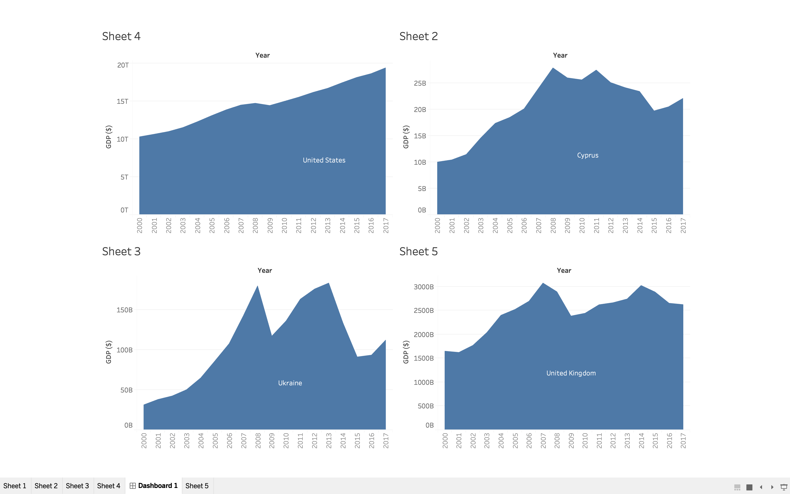

---
Apurva Modi
CS725 Spring 2019
---
# Milestone 2 

#### Data Source References 
---
- National poverty monitoring programs and the World Banks Development Research Group: poverty and inequality measures data set.
	https://data.worldbank.org/topic/poverty
- World Bank national accounts data, and OECD National Accounts data files.
	https://data.worldbank.org/indicator/NY.GDP.MKTP.CD
- International Monetary Fund, Global Financial Stability Report on Bank nonperforming loans to total gross loans.
	https://data.worldbank.org/indicator/FB.AST.NPER.ZS

---
---
#### Format of Data 
---
- Data was available in .CSV format.For all the 3 reference sources the data contains meta data.
- All the main  data sources contains values(GDP, NPL, Poverty Index) of different countries ranging from different year.
- The meta data provides with some extra information about the countries.(eg: which region they belong or which income group these country fall into) 

---
---
#### Exploratory Data Analysis 
---
- Main data contains some years with no data which was handled.
- There was data about a country field but the name of the country was not specified which was also handled.
- There were around 200+ countries out of which I am targeting only 10-15 countries based on some common knowledge about the data.
- The source data was further modified in **Tableau** for visualization.
    1. The preparation process involves distinguish identification for the data value and the header field.
    2. Then the data was further modified to make the visualization interpretation more feasible by pivoting year (columns) from previous individual year columns.
    3. After that using filtering for countries and targeted years, some initial analysis were made.
- GDP data shows some **dip for the year 2009** for all the countries, which was observed while exploring the dataset.

    

---
---
#### Limitation and Exceptions about the data 
---
- Reporting countries compile the data using different methodologies, which may also vary for different points in time for same country.

---
---
#### FDS Sheet 1: Brainstorming. 
---
[FDS Sheet 1](https://git-community.cs.odu.edu/amod/M2/blob/master/FDS-Sheet-1.pdf)

