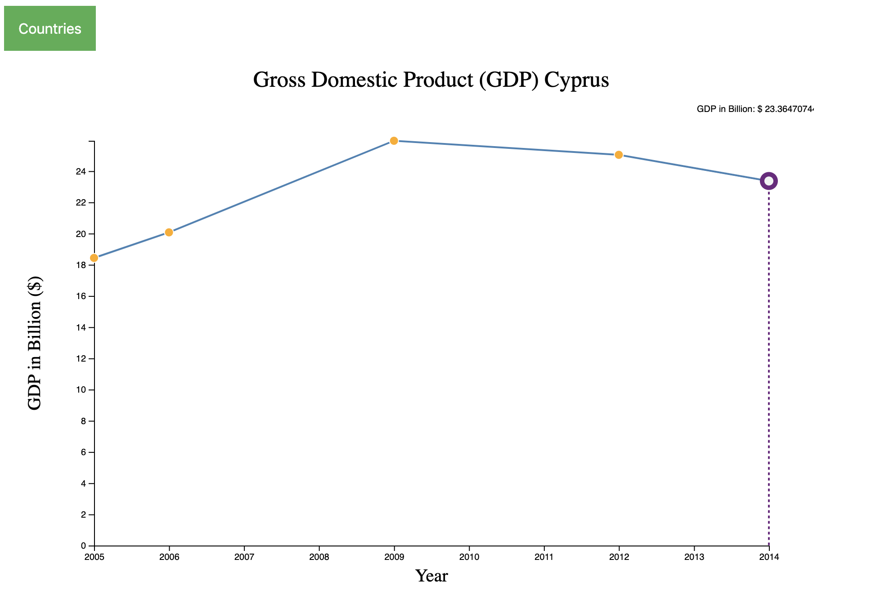
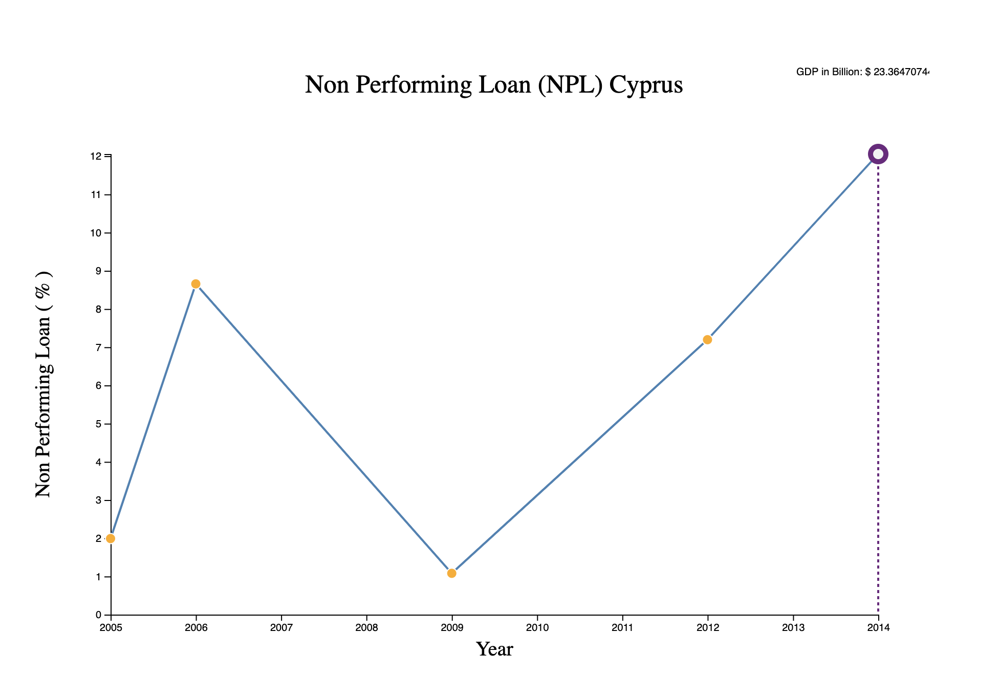
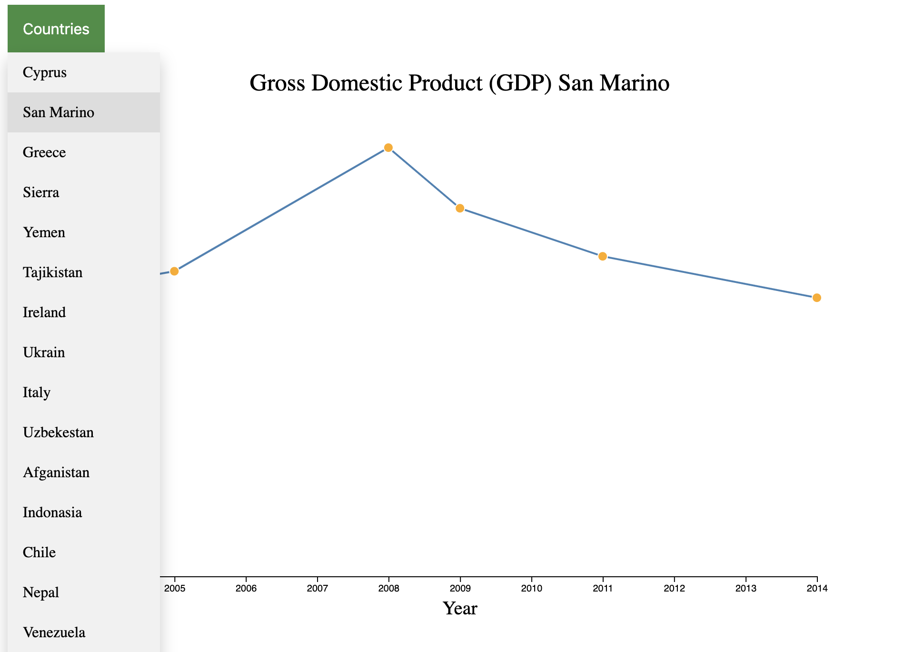

---
Apurva Modi
CS 725/825 Information Viualization.
---
# Information Visualization Project M4   [](https://www.cs.odu.edu/~amod/M4)
---
# Table of Contents

1. [Introduction](#introduction)
2. [Data](#data)
3. [Visualization](#visualization)
4. [Design Decisions](#Design-Decisions)
5. [Development Process](#development-process)
6. [Conclusion](#conclusion) 
7. [References](#references)

# Introduction

The Visualization talks about two important economic aspects **Gross Domestic Product (GDP) and Non-performing Loan (NPL)**.
##### What is GDP?
> The gross domestic product (GDP) is one of the primary indicators used to gauge the health of a country's economy. 
> It represents the total dollar value of all goods and services produced over a specific time period, 
> often referred to as the size of the economy.

##### What is NPL?
> A non-performing loan (NPL) is a loan that is several months overdue or in default. It may be the result of economic misfortune, 
> but it is more than just an indicator of a debtor’s inability (or unwillingness) to pay.

##### Question that need to be addressed by visualization
> Does the increase in Non-performing loan affect the country’s GDP?
>
> Do the financial crises lead to the downfall of the country’s GDP?
>
> Is the Non-performing loan burden on the countries economy?

# Data

Originally, the data set was taken from the sources as mentioned below. 
- World Bank national accounts data, and OECD National Accounts data files
        https://data.worldbank.org/indicator/NY.GDP.MKTP.CD
- International Monetary Fund, Global Financial Stability Report on Bank nonperforming loans to total gross loans.
        https://data.worldbank.org/indicator/FB.AST.NPER.ZS.

The primary World Bank collection of development indicators are compiled from officially-recognized international sources. It presents the most current and accurate global development data available and includes national, regional and global estimates. The table below talk about the metadata of both the datasets as both has the same acronym i.e., The World Development Indicators.

| |  |
| :----------- | :----------- |
| Type: | Time Series |
| Topics: | Economic Growth, Macroeconomic Vulnerability, and Debt |
| Economy Coverage: | High Income IBRD IDA Low Income Lower Middle Income Upper Middle Income |
| Language: | English |
| Number of Economies: | 217 |
| External Contact Email: | Data@worldbank.org |
| Access Options: | Query Tool, API Documentation, Download |
| Temporal Coverage: | 1960 - 2018 |
| Release Date: | June 11, 2010, |
| Last Updated: | January 24, 2019, |


To effectively communicate the visualization the project made use of **Gross Domestic Product (GDP)** from the *World Bank* dataset, **Non-performing loan (NPL)** from the *International Monetary Fund* dataset plotted against year for each selected countries. 
There were a lot of preparations that took place for preparing this dataset for the visualization 
for *example* the temporal coverage was reduced, missing value from the *GDP* and *NPL* was handled and unhandled data was removed, 
filtering was applied to the dataset for the year 2009 and 2014 which are marked as *Financial Crisis Year* and then 
some of the countries which have *highest NPL ratio* were selected and these are the countries that are added within the drop-down menu. 

Limitation and Exceptions about the data 
- Reporting countries compile the data using different methodologies, which may also vary for different points in time for the same country.


# Visualization

The Project consists of two line charts first on focuses on the Gross domestic product (GDP) distribution overtime while the second chart focuses on the percentage of non-performing loan (NPL) overtime. This Loan is given by world bank to reduce poverty by offering assistance to middle-income and low-income countries. The visualization consist of a *mouseover() focus function* which adds a bit of the interaction to the charts.
The body consist of a drop down menu which is reponsible for user interaction with the countries in that menu and helps them to perform analysis by themselves. After a country is selected the charts changes as per the selected country.


First line chart shows the Gross Domestic Product (GDP) overtime.
[](https://www.cs.odu.edu/~amod/M4/CY/)

Second line chart shows the Non-performing Loan (NPL) overtime.
[](https://www.cs.odu.edu/~amod/M4/CY/)

There is also a drop down menu for the viewers to analyse the trend by themselves for different countries overtime
[](https://www.cs.odu.edu/~amod/M4/CY/)


# Design Decisions

| Visual encoding | Representation |
| :----------- | :----------- |
| Idioms     | Line Charts |
| Marks      | Lines |
| Horizontal Channel    | Mapped to Years | 
| Vertical Channel    | Mapped GDP (Top chart) and NPL (Bottom chart) | 
| Tooltip    | Focuses on Year and GDP for both the Charts |
| Dropdown   | Countries |
The **Horizontal channel** here is mapped to Years and the **Vertical channel** is mapped to *GDP* and *NPL*. The chart is also affected by the spatial position and also is mapped to color atttribute of luminance as attribute.
The project follows a 10 Step designing process
1. Adding the SVG to the page to employ **STEP 2**
``` 
var svg = d3.select("#c1").append("svg")
    .attr("width", width + margin.left + margin.right)
    .attr("height", height + margin.top + margin.bottom)
  .append("g")
    .attr("transform", "translate(" + margin.left + "," + margin.top + ")");
```
2. It involves defining a body tag is where we will append our SVG and SVG objects.
3. Use of margin convention.
```
var margin = {top: 100, right: 50, bottom: 50, left: 100}
  , width = 900- margin.left - margin.right // Use the window's width 
  , height = 600 - margin.top - margin.bottom; // Use the window's height
```
4. Call the y axis in a group tag
``` 
svg.append("g")
    .attr("class", "y axis")
    .call(d3.axisLeft(yScale)); // Create an axis component with d3.axisLeft
```
5. X scale will use the index of our data.
```
var xScale = d3.scaleTime()
              .domain([minDate,maxDate])
              .range([0, width])
```
6. Y scale will use the randomly generate number 
```
var yScale = d3.scaleLinear()
yScale.domain([0, d3.max(data, function(d){ return d.GDP/1000000000;})]) // input 
    .range([height, 0]); // output
```
7. Generate line as follows
```
var line = d3.line()
    .x(function(d, i) { return xScale(d.year); }) // set the x values for the line generator
    .y(function(d) { return yScale(d.GDP/1000000000); }) // set the y values for the line generator
```
8. Append the path, bind the data, and call the line generator 
```
svg.append("path")
    .datum(data) // 10. Binds data to the line 
    .attr("class", "line") // Assign a class for styling 
    .attr("d", line); // 11. Calls the line generator 
```
9. Appends a circle for each datapoint 
```
svg.selectAll(".dot")
    .data(data)
  .enter().append("circle") // Uses the enter().append() method
    .attr("class", "dot") // Assign a class for styling
    .attr("cx", function(d, i) { return xScale(d.year) })
    .attr("cy", function(d) { return yScale(d.GDP/1000000000) })
    .attr("r", 5);
```
10. Finally add text to the axis and the tittle and then add a *mousemove()* to add a *focus element*, also at the end define a style sheet to add color to the viualizations.


# Development Process

As mentioned above the aim project to find the correlation between the Gross domestic product (GDP) and Non-performing loan (NPL), so most of the time was dedicated to preparing the data. A lot of data cleaning and filtering were imposed to finally get the desired data for the proposed visualization. 
Finally, the project was completed within the given time span. Defining the axis was time-consuming as compared to plotting lines, dot and making the path, concentration towards the tutorial on how to plot different elements helped the project.

# Conclusion
By visualzating different country's GDP and NPL, analysis were made which are as follows
> Mostly Financial Crises triggers the downfall of the gross domestic product (GDP)
> but non-performing loan (NPL) adds more burden to the country's economy.

# References 
| Purpose | Links |
| :----------- | :----------- |
| D3 API | https://github.com/d3/d3/blob/master/API.md |
| D3 Axis | https://bl.ocks.org/cpang4/1f46cb01ba236063a46a7bfe39187f8f |
| D3 mouseover | view-source:https://www.cs.odu.edu/~hhallak/cs725/HW9/index.html |
| D3 Line Chart | https://bl.ocks.org/gordlea/27370d1eea8464b04538e6d8ced39e89 |
| Financial Crisis  |https://en.wikipedia.org/wiki/Financial_crisis |
| GDP Data  | http://wdi.worldbank.org/table/4.2 |
| NPL Data | http://wdi.worldbank.org/table/5.5 |